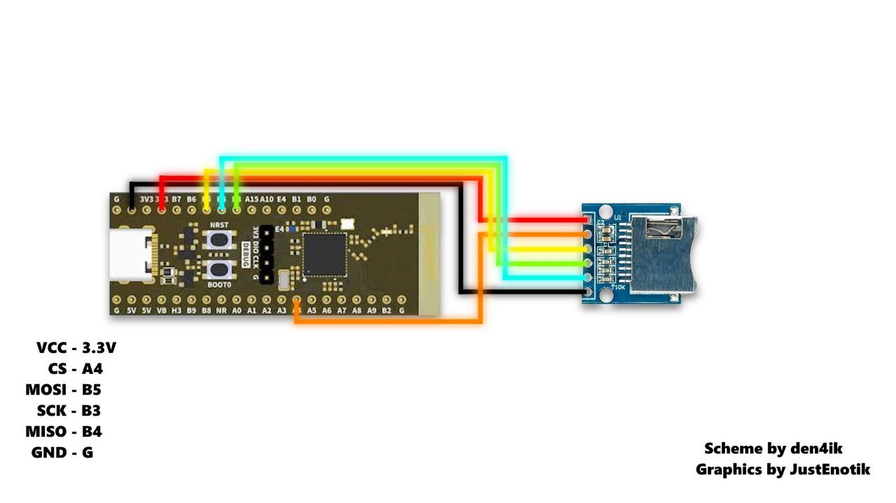
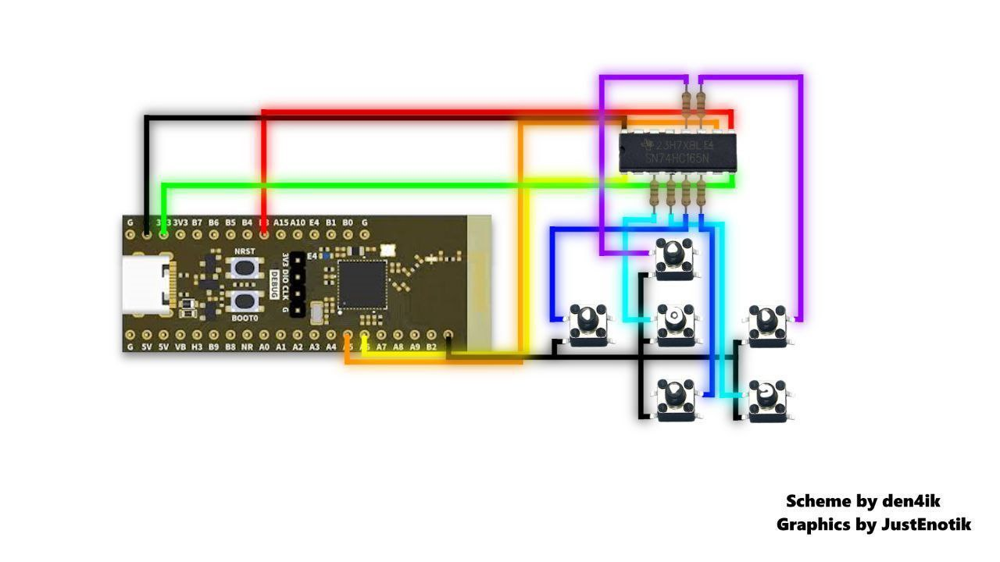
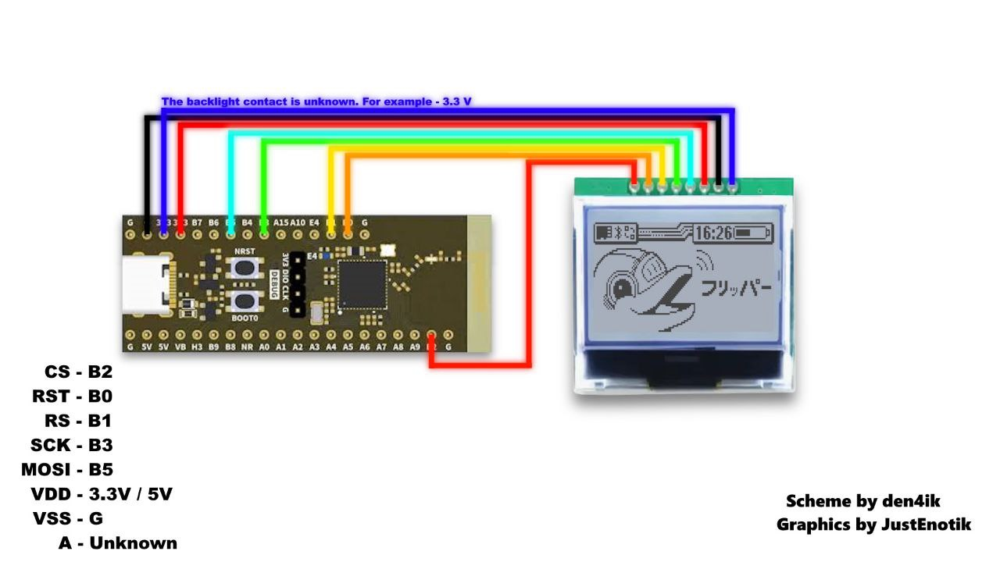
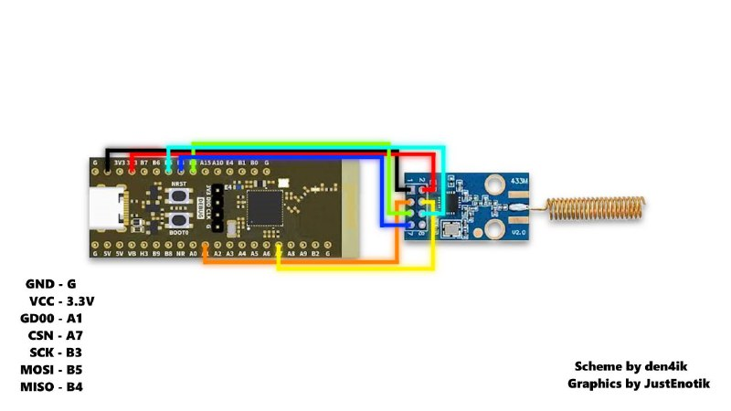
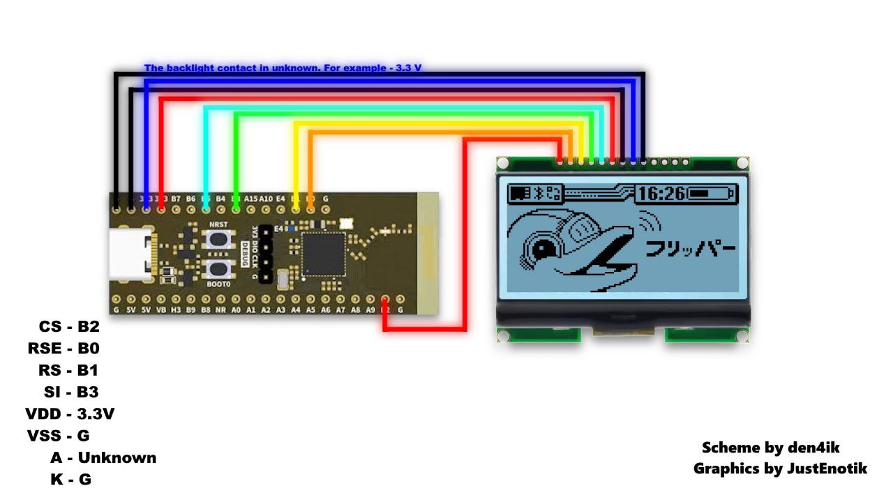

# Guide: STM32WB55CGU6 as "Flipper Zero"


This repository documents, in a straightforward way, how to configure an **STM32WB55CGU6** board to function similarly to the Flipper Zero. The focus is: generating **OTP** data, writing it safely, and installing a **modified firmware** compatible with the pinout.

---

## What you'll need

**Hardware**

- [STM32WB55CGU6](https://s.click.aliexpress.com/e/_ooz1OoJ)
- [CC1101](https://s.click.aliexpress.com/e/_opX4ZvH)
- [SDCARD MODULE](https://s.click.aliexpress.com/e/_oFUjjgb)
- **Display options**
  - [DISPLAY 8 PIN](https://s.click.aliexpress.com/e/_oD1csAb)
  - [DISPLAY 13 PIN](https://s.click.aliexpress.com/e/_okIv2gB)

**Software**

- [**qFlipper**](https://flipperzero.one/downloads)
- [**STM32CubeProgrammer**](https://www.st.com/en/development-tools/stm32cubeprog.html#get-software)
- [**Zadig**](https://zadig.akeo.ie/)

---

## Before you start

- This process involves writing to OTP (One-Time Programmable) memory. Proceed with caution.
- Keep your laptop/PC connected to power and avoid USB cable disconnections.
- Have the correct drivers ready (on some PCs, you'll need to use **Zadig** to select **USB Serial** or **WinUSB**).

---

## Step 1 — Create the OTP file

OTP records unique device information (name, color, region, etc.).

1. Open the OTP utility (for example, `qFlipper OTP.exe`).
2. Fill in the fields as needed:
   - Version: 12 | Firmware: 7 | Body: 9 | Connection: 6
   - Display (显示屏型号): `mgg`
   - Color: black, white, or transparent
   - Region: `en_ru`, `us_ca_au`, `jp`, or `world`
   - Name: up to 8 characters (latin and numbers only)
3. Define a name for the generated file and click **Generate file**.

---

## Step 2 — Write OTP to the microcontroller

Warning: writing OTP is a sensitive action; proceed at your own risk.

1. Connect the board to PC while holding the **BOOT0** button pressed.
2. Open **STM32CubeProgrammer** and select **USB** as connection type.
3. Update the device list, choose the detected port, and click **Connect**.
4. Select the OTP file generated in the previous step.
5. In "Start Address", enter:

   ```
   0x1FFF7000
   ```

6. Click **Start Programming** and wait for completion.

If the process freezes or the device "disappears": close everything, reinstall drivers/STM32CubeProgrammer, change USB port, and try again.

---

## Step 3 — Upload custom firmware (qFlipper)

Recommendation: remove the **microSD card** from this step to avoid error messages.

1. Open **qFlipper** with the board connected.
2. If the device doesn't appear, install via **Zadig** the **USB Serial** or **WinUSB** driver.
3. If the maintenance screen appears, click **Repair** and wait. Repeat 1-3 times if necessary.
4. Choose **Install from file** and select the **modified firmware** (`.dfu`).
5. Wait for the installation to complete.

---

## Diagrams

**SDCard**


**Buttons**


**Display 8 Pins**


**CC1101**


**Display 14pins**


## Step 4 — Prepare the microSD

With the firmware active, copy to the **microSD** the recommended databases and folders (default content to avoid errors when using protocols/functions).

---

## Quick troubleshooting

- Device doesn't appear in qFlipper: check cables/USB port and reinstall drivers with **Zadig**.
- OTP programming failure: confirm address `0x1FFF7000`, restart **STM32CubeProgrammer**, and try again.
- "Repair" loop: repeat the process up to 3 times; if it persists, reinstall qFlipper.

---

## Final notes

- Ensure the **modified firmware** matches your hardware pinout.
- Review OTP information before writing—it's a one-time write.
- Backup microSD files and the firmware used.

---

## Credits

Nucleus Dark
Just Enotik
den4ik
